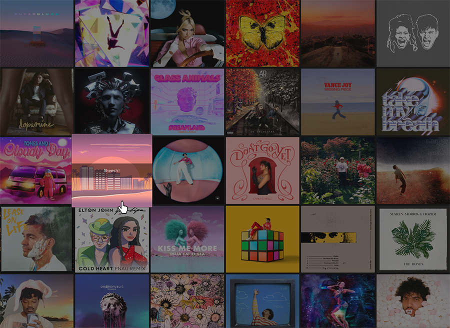

# Exercise

This is an exercise in making a simple playlist visualisation using the Spotify APIs.

## Prerequisites

1. Fork [this repository](https://github.com/zatine/playlist-visualisation).
2. Create a [Spotify](https://www.spotify.com/) account.
3. Create a [Spotify App](https://developer.spotify.com/documentation/general/guides/authorization/app-settings/). You can call it "playlist-visualisation". A client ID is generated for your app. We will use this later, so keep the tab open for now.
4. Clone your forked repository to your machine. You will need node and npm to continue ([installation instructions here](https://docs.npmjs.com/downloading-and-installing-node-js-and-npm)). Run `npm install` to install dependencies.
5. Your environment should be ready to go. Run `npm run dev` to start the developer version of the app locally. It can be found at [http://localhost:8080/].
6. Copy the `.env.example` file into a new one called `.env`. You can see that there is a placeholder variable called `CLIENT_ID` in there. Replace this with your actual client ID, the one from step 3.

> Note: Do _not_ publish your client ID on github. This would allow anyone to make requests as if they were your application. This is why we are adding it to the `.env` file, which will not be committed due to `.gitignore`. However, note that _using the .env-file is not a safe way if you choose to publish this app online_. Ideally, your client ID should be hidden in a backend. Anything that is exposed in the client will be visible to someone that is looking for it.

## Calling the Spotify playlist API

In order to use the [Spotify APIs](https://developer.spotify.com/documentation/web-api/reference/#/), we need an access token to authorize our requests.

1. Create a button with an ID of "login-button" in `src/index.html` to allow the user to log in to their Spotify account. There is already some makeshift styling included in the project.
2. Add an event listener to the button we just created in `src/js/authorize.js`. Let's just log something for now to make sure it works.
3. We will be using the [implicit grant flow](https://developer.spotify.com/documentation/general/guides/authorization/implicit-grant/) for authorisation. As described in the documentation, it is a simple flow that allows us to authorise a user without server-side code. Follow the documentation to redirect the user to the authorisation page when clicking on the login button. We want to redirect the user to [http://localhost:8080/playlist.html].
4. Even if we seem to redirect properly, we will most likely see an error now, telling us that the redirect URL is invalid. We need to go back into the [Spotify App Dashboard](https://developer.spotify.com/dashboard/) and add the redirect URL to the list of allowed redirects for our app. After adding it, try the flow again.
5. We should now end up at a simple page with a "Playlist" heading. Looking at the URL, we can see that a lot of information is added to the hash. Among these is an _access token_.
6. Let's take a look at the endpoint we will be calling, [Get Playlist](https://developer.spotify.com/console/get-playlist/). This is the Spotify for Developers Console, where you can easily explore different endpoints, their options and what kind of response they will give you. There is also a helpful button to fill sample data in order to make a request. You can see that if we change something here, the `curl` request to the right changes. Play around with it for a bit to see what is required from us. You might notice that the request fails unless you provide the `OAuth Access Token`, which is the same one we are getting in our redirect URL hash. Once you have a working request giving you data for a playlist, let's recreate that request in our app.
7. Since the access token is required, we can start by implementing a function in `src/playlist.js` that will retreive it from the URL.
8. Once we have the access token, let's recreate the request from the developer console in step 6. We can do this by using the [fetch API](https://developer.mozilla.org/en-US/docs/Web/API/Fetch_API) for example. We can start by just logging the results of the request.
9. Looking at the result of the request, we can see that each playlist we get a list of `items` under `tracks`. Each item has a `track` property, which gives us information about the song. We can see things like the name, who made it, links to the album art and in some cases even a preview URL to play a sample of the song. This is the information we'll be using for the exercise.

## Rendering a playlist visualisation



1. Above is a preview of the end result we want to achieve. We want to start by rendering a grid item for each track in the playlist. In order to achieve the same style, the output should be as follows:

```html
<div class="playlist-item">
  
  <div class="playlist-item-title">SONG_TITLE</div>
</div>
```

It should be rendered inside the `div` with the ID of `#tracks`.

2. Next, we want this to be a bit more interactive. If the track has a `preview_url`, we can use the [audio element](https://developer.mozilla.org/en-US/docs/Web/HTML/Element/audio) to play it. Let's add an `audio` element to `playlist.html` and give it an ID of "audio-player".
3. For each track that has a `preview_url`, we want to make it so that it updates the source of the `audio` element and plays the preview. If the track does not have a preview, we want to stop the current playback. A simple way to do this is to add an event handler to each track when rendering it.
4. Cool, so now the tracks play once you click on them! But it would be even nicer if the track that is currently playing stayed in an active state for as long as the music is playing. So let's make sure that when a song is playing, we add the `active` class to the appropriate `playlist-item` `div`, and remove it from any other playlist items.
5. All done! See if you can find any improvements to be made to make the code easier to read or more performant.

## Next steps

It's time to make this app your very own. Here are some suggestions on things you can explore.

- **Visualisation** - play around with the styling to make the app look exactly how you want it.
- **Use additional APIs** - there is plenty of cool information about all tracks in the Spotify APIs, did you know that you can see the level of danceability or acousticness for a song? Use this information to spice up the visualisations even further. Take a look at the [audio features API](https://developer.spotify.com/console/get-audio-features-several-tracks/) for example.
- **Security** - add a backend layer which stores your client ID and allows you to make secure requests even if the app is published online.

## Building the app

In order to build the app for publishing, run:

```
npm run build
```

This will generate a ready-to-run app in the `build` folder.
